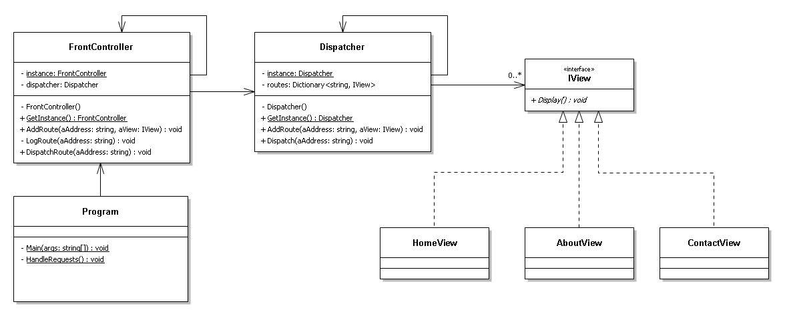

# Front-Controller
Síntese sobre o padrão de desenho *Front Controller* para a cadeira de Desenho Implementação de *Software* da Universidade da Madeira.

Síntese realizada por:
* Gonçalo Passos 2030415
* Henrique Sousa 2094515
* João Alves 2041916
* Diogo Matthew 2042816

## Contexto

O padrão de desenho *Front Controller* é um padrão que fornece um mecanismo centralizado para tratar pedidos, redirecionando o pedido para uma entidade final, que é responsável pelo mesmo.

O padrão Front Controller é constituído pelas seguintes entidades:
* ***Controller*** – É o ponto de contacto inicial para lidar com todas os pedidos do sistema. Pode ter auxílio de outras entidades para os processos de autenticação, ou outro tipo de processamento, antes do pedido chegar ao processo responsável por esse pedido.
* ***Dispatcher*** – Entidade responsável por redirecionar os pedidos para a entidade final  responsável por tratar o pedido.
* ***View*** – Uma *view* representa e exibe informações solicitadas para o cliente. É a entidade aos quais os pedidos se referem.

Pode ser implementado em aplicações *web* ou *desktop*, sendo independente de linguagens de programação. Atualmente, é muito utilizado em *frameworks* de desenvolvimento *web*, na implementação de mecanismos de rotas.

## Problema

Num site com um maior nível de complexidade existem muitas tarefas semelhantes que são necessárias para lidar com os pedidos. Essas tarefas são por exemplo: segurança e autenticação, internacionalização, mostrar *views* particulares para um tipo de utilizador. Se os tratamentos de pedidos forem feitos por cada objeto, então provavelmente muitas destas tarefas serão implementadas em duplicado, indo contra o princípio [DRY](https://dzone.com/articles/is-your-code-dry-or-wet).
Além disso, como o controlo está dividido por vários objetos, a manutenção de uma dessas tarefas tornasse mais difícil porque seria necessário fazer as mesmas alterações nos vários objetos, e consequentes objectos afectados.

## Solução

A solução que o padrão de desenho *Front Controller* fornece é a utilização de um controlador como o ponto de inicial de contacto para lidar com todos os pedidos da Aplicação. O controlador processa os pedidos, faz a chamada de serviços de segurança como autenticação e autorização, serviço de logs, entre outros e delega  o processamento das regras de negócio para a views (fazendo a escolha de uma view apropriada). As *views* ficam responsáveis apenas por tratar do recurso requisitado pelo cliente. A centralização dos pontos de decisão e tratamento trará uma redução do código necessário, e da sua complexidade.

## Consequências
TO DO
### Vantagens
TO DO
### Desvantagens
A nível das desvantagens:
* **Ponto de falha** - Como há centralização de pedidos numa entidade, se ocorrer qualquer tipo de falha nessa entidade, poderá pôr em risco o funcionamento do tratamento dos pedidos, ou seja, há uma dependência imensa nessa entidade (controlador).

* **Desempenho** - Pior desempenho nas situações onde não é necessário fazer nenhum processamento, ou seja, só necessita de redirecionamento do pedido. Um caso concreto onde o desempenho fica prejudicado é na autenticação. 

* **Complexidade** - TODO

## Aplicabilidade
Devemos utilizar o padrão de desenho *Front Controller* quando:
* se quer encapsular a funcionalidade comum de tratamento de pedidos em um único lugar.
* se deseja implementar o tratamento dinâmico de pedidos, ou seja, alterar o roteamento sem modificar o código.
* se quer tornar a configuração do servidor *web* portátil, só é necessário registar a forma específica como serão manipulados os pedidos.
## Outros Padrões
O Padrão *Front Controller* é uma especialização do padrão [Mediator](https://refactoring.guru/design-patterns/mediator).
O padrão *Front Controller* pode ser utilizado em conjunção com outros padrões:
* O [*Chain of Responsability*](https://refactoring.guru/design-patterns/chain-of-responsibility) pode ser utilizado para criar um sistema de *middlewares*. Estes *middlewares* serão responsáveis por fazer o processamento (em cadeia) de algumas tarefas comuns em certos pedidos. O *handler* final pode ter acesso aos dados gerados no processamento de cada *middleware*.
* O padrão [*Command*](https://refactoring.guru/design-patterns/command) pode ser usado para encapsular os pedidos.

## Utilizações
Este padrão é muito utilizado em Aplicações *Web* e é implementado em diversas *Frameworks*:
* C# / .NET: [ASP.NET](https://asp.net/)
* PHP: [Laravel](https://laravel.com/), [CakePHP](https://cakephp.org/), [Symfony](https://symfony.com/), [CodeIgniter](https://codeigniter.com/) e [Zend Framework](https://framework.zend.com/).
* JavaScript: [Express.js](https://expressjs.com/), [AdonisJs](https://adonisjs.com/).
* Java: [Spring Framework](https://spring.io/), [Apache Struts](https://struts.apache.org/).
## Exemplo

Na pasta *Example* está disponível um exemplo de implementação do padrão *Front Controller*.
Foi definida uma *Interface* *IView* que todas as *views* têm de implementar. Essa *interface* define o método *Display* que será chamado pelo *Dispatcher* quando receber um pedido para essa *view*.

A Classe *Dispatcher* é *singleton* e basicamente fica responsável por guardar em memória as relações entre uma rota (nome) e uma referência do tipo *IView*.  É responsável também por chamar o método *Display* dada uma rota (nome).

A Classe *FrontController*, também *singleton*, fica responsável por fazer a ponte entre o cliente e o *Dispatcher*. Nesta implementação possui uma função para fazer *log* dos pedidos recebidos (mostrar no ecrã a rota requisitada).

Por fim, o programa principal (cliente), adiciona as rotas através do *Front Controller*, passando o nome da rota e a referência a respetiva *view*, e chama uma função *HandleRequests*. Essa função executa em *loop* e pergunta ao utilizador qual é a rota que  este pretende aceder, passando esse pedido ao *Front Controller*.